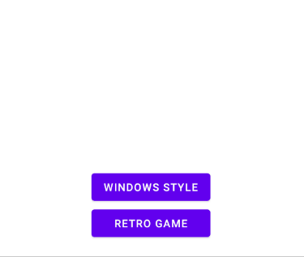

# RetroDialogs
[](https://jitpack.io/#avivfox93/RetroDialogs)

## How to Use:
Add it in your root build.gradle at the end of repositories:
```gradle
allprojects {
    repositories {
        ...
        maven { url 'https://jitpack.io' }
    }
}
```
Then add the dependency
```gradle
dependencies {
        implementation 'com.github.avivfox93:RetroDialogs:Tag'
}
```

## Example:
### Creating a Windows retro like Info Dialog:

```java
WindowsDialog windowsDialog = new WindowsDialog(this);

windowsDialog.enableYesButton(()->{
    Log.e("Retro","Yes selected");
});

windowsDialog.enableNoButton(()->{
    Log.e("Retro","No selected");
});

windowsDialog.enableCancelButton(()->{
    Log.e("Retro","Cancel selected");
    windowsDialog.dismiss();
});

windowsDialog.enableExitButton(()->{
    Log.e("Retro","Exit selected");
    windowsDialog.dismiss();
});

windowsDialog.setBodyText("This is the body :)");

windowsDialog.setDialogType(RetroDialog.DialogType.INFO);
windowsDialog.show();
```
### Creating a Retro game Dialog:

```java
RetroGameDialog retroGameDialog = new RetroGameDialog(this);
retroGameDialog.enableYesButton(()->{
    Toast.makeText(this,"Yes Slected",Toast.LENGTH_LONG).show();
});
retroGameDialog.enableNoButton(()->{
    Toast.makeText(this,"No Slected",Toast.LENGTH_LONG).show();
});
retroGameDialog.enableCancelButton(()->{
    Toast.makeText(this,"Cancel Slected",Toast.LENGTH_LONG).show();
    retroGameDialog.dismiss();
});
retroGameDialog.setText("Just an example...\nHow Are You?\nEnjoy!");
retroGameDialog.show();
retroGameDialog.startAnimation(this,150,true);
```

## TODO:
For now, there is only Windows 98 style dialog available.
In the future I need to add the following:
- [ ] Windows XP
- [ ] Macintosh
- [x] Retro gaming dialogs

Feel free to add suggestions/issues through the issues tab.

[](https://opensource.org/licenses/Apache-2.0)
